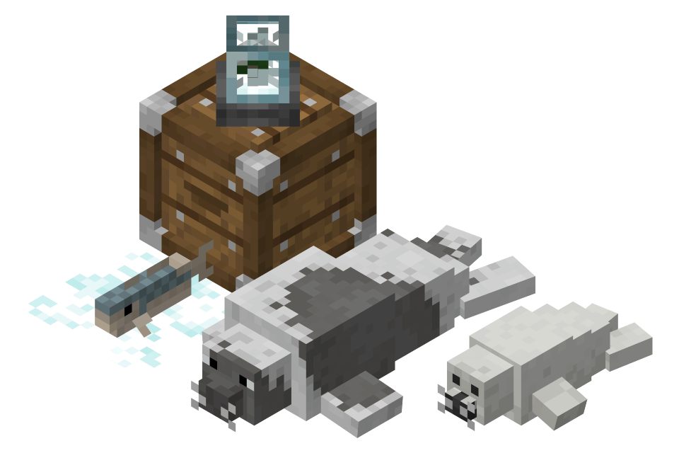

(Rustic's) Bountiful Seals
=======

  
 Makes the colder biomes feel livelier with more items, blocks and entities. This mod adds Arctic Cod, Harp Seals, Snow Globes, and more. It also adds the crate block, crafted with a chest, planks and iron, which can store a lot of one type of item or block, but it can't store anything else, making it an early game bulk storage option.

This mod is only out for Neoforge 1.21.1 currently.
 

#### If you encounter any bugs or have a suggestion, please report it on my [Github page](https://github.com/Rustic-Potatoes/Bountiful-Seals-NeoForge/).

---

#### Links:

- Curseforge: TBD

---
